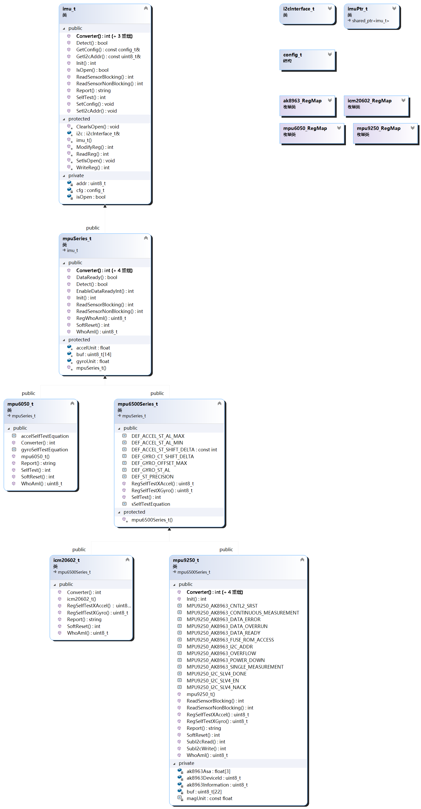

# DRV_IMU_InvenSense
[toc]

## 1.简介
这是给mpu6050,mpu9250,icm20602等InvenSense的imu设计的驱动，鉴于i2c的简便和可靠性本驱动仅设计了以i2c为接口。

注意，自检的时候保持传感器静止，自检不通过说明传感器内部微机械结构已经出问题了，建议更换传感器

返回类型为int的函数返回错误码，为0代表正常，其余都是错误。

返回类型为bool的函数返回true代表成功，false失败，和返回int的函数刚好相反

override方法的注释请参看它在基类中的注释

## 2.类图

## 3.API

### 3.1各部分的简单说明

class i2cInterface_t;//i2c接口类
struct config_t;//设置量程和数字低通滤波器
class imu_t;//imu接口类
class mpuSeries_t;//基类，抽象出invensense的mpu系列以及部分icm系列imu的初始化/数据转换api
class mpu6050_t;//mpu6050驱动
class mpu6500Series_t;//基类，抽象出mpu6500系列以及部分icm系列imu的自检api
class icm20602_t;//icm20602驱动
class mpu9250_t;//mpu9250驱动
class imuPtr_t;//imu的智能指针类，用于实例化imu对象

## 5.使用说明
